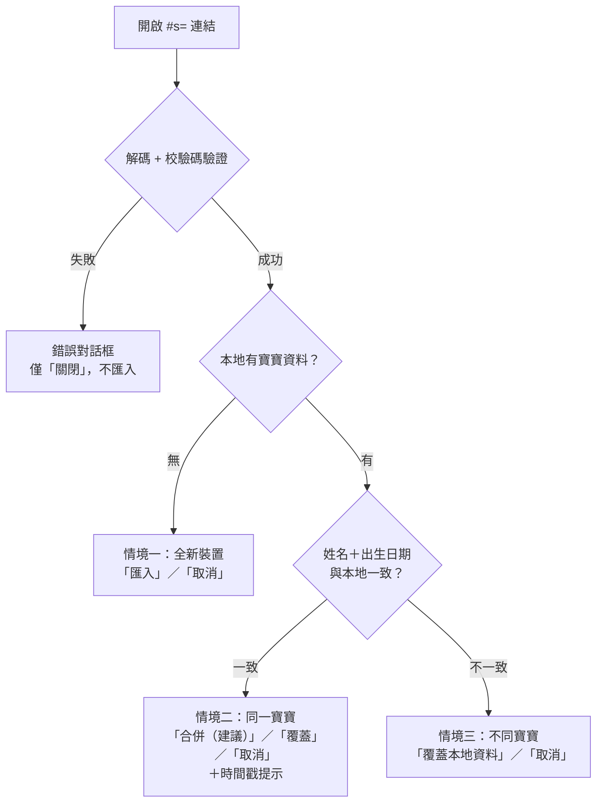

# 分享進度功能規格說明（Share Progress via URL）

> 對應實作：`share.js`（分支 `feature/share-progress-url`）
> Payload 格式版本：**v1**
> 最後更新：2026-07-05

---

## 1. 功能目標與使用情境

讓使用者把目前的勾選狀態與記錄資訊編碼進一條網址，傳給另一台裝置或另一位家長；收到的人打開連結就能看到（並匯入）一樣的狀態和進度。

| 情境 | 說明 |
| --- | --- |
| 跨裝置 | 媽媽在手機版網頁記錄後，分享到電腦版網頁看詳細記錄 |
| 雙親共同記錄 | 媽媽分享給爸爸，兩人各自記錄後可再互相分享「合併」回來 |

**同步模型：快照式（snapshot）**。每次分享是當下狀態的複本，不是即時雙向同步。資料全程不經過伺服器（維持專案「不上傳伺服器」原則）。

---

## 2. 網址與 Payload 格式

### 2.1 網址形式

```
https://<host>/<path>#s=<flag>.<base64url>
```

- 使用 **hash（`#`）而非 query（`?`）**：hash 不會被送到伺服器，也不會進 server log。
- `flag`：`1` = payload 經 `deflate-raw` 壓縮；`0` = 未壓縮（不支援 CompressionStream 的舊瀏覽器退路）。
- 長度實測：4 筆記錄約 222 字元；166 項全勾（最壞情況）約 530 字元。

### 2.2 Payload（v1，JSON）

| 欄位 | 型別 | 說明 |
| --- | --- | --- |
| `v` | number | 格式版本，目前為 `1` |
| `t` | number | **分享建立時間戳**（epoch 秒） |
| `n` | string | **寶寶姓名** |
| `b` | string | **出生日期**（`YYYY-MM-DD`） |
| `c` | object | 勾選紀錄：`{ 里程碑idx: { 項目key: [狀態字元, 出生後天數] } }` |
| `h` | string | SHA-256 校驗碼（前 12 bytes，base64url） |

- 狀態字元對照：`a`=ahead、`o`=ontime、`d`=delayed、`n`=normal、`r`=retro、`i`=intermediate（後三者為舊版格式，匯入後由 `normState()` 正規化顯示）。
- 日期以「出生後第幾天」的整數儲存以縮短長度；無日期的舊格式記錄只存狀態字元。

### 2.3 防竄改（不可修改性）

- `h` = SHA-256(canonical JSON of `{v, t, n, b, c}`) 之前 12 bytes，base64url 編碼。
- 開啟連結時**重新計算校驗碼比對**：`t`（時間戳）、`n`（姓名）、`b`（出生日期）、`c`（勾選紀錄）任何一項被修改，即拒絕匯入且不動本地資料。
- 產生校驗碼需要 `crypto.subtle`，因此分享功能要求安全連線（HTTPS 或 localhost）；非安全連線點「分享」會顯示提示並中止。

---

## 3. 開啟分享連結：判斷流程與匯入選項

每次開啟帶 `#s=` 的網址，依序執行：**解碼驗證 → 與本地比對（姓名、出生日期、時間戳）→ 依情境給不同選項**。



### 3.0 驗證失敗（不進入匯入）

| 錯誤 | 訊息重點 | 選項 |
| --- | --- | --- |
| 校驗碼不符（`tampered`） | 內容可能已遭修改或傳輸中損毀，未匯入任何資料 | 關閉 |
| 版本過新（`bad-version`，`v` > 1） | 請先更新應用程式 | 關閉 |
| 瀏覽器無法解壓（`no-decompress`） | 請更新瀏覽器 | 關閉 |
| 格式錯誤／連結不完整（`bad-format`） | 請對方重新分享一次 | 關閉 |

任何失敗情況都會清除網址 hash、完全不寫入 localStorage。

### 3.1 情境一：本地沒有任何資料（全新裝置）

- 對話框標題：「收到分享的追蹤記錄」。
- 顯示資訊卡：寶寶姓名、出生日期、勾選記錄筆數、分享建立時間。
- 選項：
  - **匯入**（primary）：整份寫入（姓名、出生日期、全部勾選紀錄）。
  - **取消**（secondary）：不匯入，清除 hash。

### 3.2 情境二：同一個寶寶（姓名與出生日期都與本地一致）

- 對話框標題：「收到同一個寶寶的分享」。
- 顯示資訊卡（同上），並依**時間戳比對**附加提示（可同時出現）：
  - `payload.t ≤ last_import_t` →「這份分享先前已匯入過（或比上次匯入的更舊）。」
  - `payload.t × 1000 < data_ts`（本地最後更新比分享新）→「本地記錄最後更新於 …，比這份分享新，建議選『合併』保留兩邊記錄。」
- 選項：
  - **合併（建議）**（primary，預設推薦）：逐項合併，規則見 §4。姓名與出生日期維持本地（兩邊相同）。
  - **覆蓋**（danger）：刪除本地全部 `checks_*` 後整份寫入分享內容。
  - **取消**（secondary）：不動任何資料。

### 3.3 情境三：不同寶寶（姓名或出生日期與本地不一致）

- 對話框標題：「分享的寶寶與本地不同」。
- 顯示資訊卡＋警告：「這台裝置目前追蹤的是『〈本地姓名〉（〈本地出生日期〉）』。覆蓋後本地的勾選記錄將全部被取代，且無法復原。」
- 選項：
  - **覆蓋本地資料**（danger）：整份取代（含姓名與出生日期）。
  - **取消**（primary——把安全選項設為視覺主按鈕，降低誤按覆蓋的風險）。
- **不提供「合併」**：不同寶寶的記錄合併沒有意義，也避免資料混淆。

---

## 4. 合併規則（僅情境二提供）

以「項目」為單位（例如 `checks_0` 內的 `gross_0`）：

| 狀況 | 結果 |
| --- | --- |
| 只有本地有記錄 | 保留本地 |
| 只有分享有記錄 | 採用分享 |
| 兩邊都有記錄 | **保留達成日期較早者**（先達成的才是事實）；日期相同保留本地 |
| 分享的記錄無日期（舊格式） | 視為較舊，保留本地 |
| 本地記錄無日期、分享有日期 | 本地無日期記錄視為既有事實，保留本地 |

未勾選（`false`）不視為記錄，不會蓋掉對方的已勾選。

---

## 5. 匯入完成後的行為

1. 寫入 `last_import_t = payload.t`（epoch 秒）。
2. 更新 `data_ts = Date.now()`（epoch 毫秒）。
3. 以 `history.replaceState` 清除網址中的 `#s=…`——重新整理不會重複跳出確認框。
4. 重新渲染畫面（`initApp()`）。
5. 顯示 toast：「已匯入分享的追蹤記錄」／「已合併分享的追蹤記錄」／「已覆蓋為分享的追蹤記錄」。

### 相關 localStorage 鍵

| 鍵名 | 用途 |
| --- | --- |
| `data_ts` | 本地資料最後更新時間（epoch 毫秒）。每次勾選、更改資料、重設、匯入都會更新，供情境二的時間戳比對 |
| `last_import_t` | 最近一次匯入的分享建立時間戳（epoch 秒），偵測重複匯入 |

---

## 6. 分享端行為（產生連結）

入口：topbar「分享」按鈕（`shareProgress()`）。

1. 未填寶寶姓名／出生日期 → 提示後中止。
2. 非安全連線（無 `crypto.subtle`）→ 對話框說明需 HTTPS，中止。
3. 產生連結後依環境遞補：
   - 有 `navigator.share`（手機為主）→ 開原生分享面板；使用者取消（`AbortError`）則靜默結束。
   - 否則 `navigator.clipboard.writeText` → toast「分享連結已複製…」。
   - 剪貼簿也不可用 → `prompt()` 讓使用者手動複製。

---

## 7. 相容性與限制

- **壓縮**：`CompressionStream('deflate-raw')`，Chrome 80+／Safari 16.4+。編碼端不支援時自動退回未壓縮（`flag=0`，最壞約 1.9KB，仍可用）；解碼端遇到 `flag=1` 但無 `DecompressionStream` 時顯示「請更新瀏覽器」。
- **版本演進**：payload 格式變更時必須遞增 `v`；解碼端遇到 `v` 大於自身支援版本一律拒絕並提示更新，不做部分解讀。
- **隱私界線**：連結本身就是資料——取得連結的人即可看到記錄內容。校驗碼防「竄改」，不提供「加密」；如需限制讀取對象，屬未來範圍（需金鑰交換或後端，超出純前端架構）。
- **已知取捨**：同一寶寶但兩邊姓名打字不同（如「小橘子」vs「橘子」）會被判為不同寶寶，只能覆蓋。此為刻意保守設計，避免錯誤合併。

---

## 8. 驗收測試對照（2026-07-05 實測通過）

| # | 情境 | 結果 |
| --- | --- | --- |
| 1 | 全新裝置開啟連結 → 匯入 | 4 筆記錄含日期完整還原、hash 清除、toast 顯示 |
| 2 | 同一寶寶、重疊項目日期較晚＋新項目 → 合併 | 保留較早日期、新項目併入、其餘不動 |
| 3 | 竄改姓名但未改校驗碼 | 拒絕匯入、本地資料完好 |
| 4 | 不同寶寶的分享 | 警告對話框、僅覆蓋／取消 |
| 5 | 分享已匯入過＋本地較新 | 兩則時間戳提示同時顯示 |
| 6 | 舊格式狀態值（`"normal"` 字串） | 正常編碼、匯入後正常顯示 |
| 7 | 手機視窗（375px）＋深色模式 | 對話框、按鈕、toast 排版正常 |
